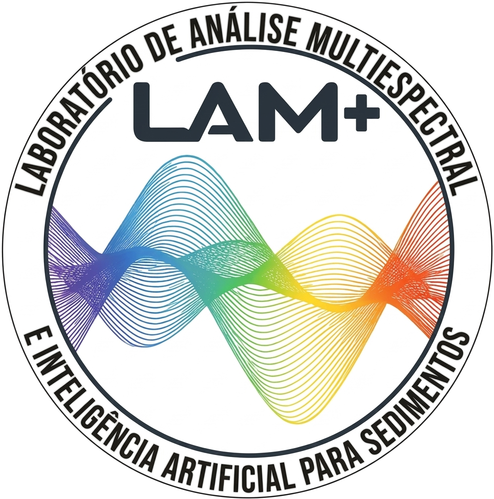

<p align="center">
  
</p>

<p align="center">
  <a href="https://github.com/lam-plus/lamplus-Avaatech-QC/actions/workflows/tests.yml"></a>
  <a href="https://doi.org/10.5281/zenodo.21855319"></a>
  <a href="https://www.python.org"></a>
  <a href="LICENSE"></a>
  <a href="https://streamlit.io"></a>
  <a href="https://github.com/lam-plus/lamplus-Avaatech-QC/security/dependabot"></a>
</p>

# LAM+ Core Quality Check (QC) tool

**LAM+ Core QC** is a quality-control tool for X-ray fluorescence (XRF)
core-scanning data acquired on an **Avaatech XRF Core Scanner**. It reads
the `.xlsx` workbook exported by the instrument, runs five automated QC
checks against the raw measurements, assigns a single per-row **Quality
Flag (QF)**, and produces a colored Excel report plus a text summary you
can act on without inspecting every row by hand.

It is built and maintained by the **Laboratory for Multispectral Analysis
and Artificial Intelligence in Sedimentary Research (LAM+)** (Universidade
Federal Fluminense, UFF) for its own core-scanning workflow, and shared
here for anyone running the same instrument who wants a fast, repeatable
QC pass over their raw exports.

## What it does

- Reads a multi-energy Avaatech workbook (one sheet per energy: `10kV`,
  `30kV`, `50kV`) and validates that each sheet has the columns its energy
  requires before running anything.
- Runs five QC modules (QC1–QC5, see table below) against the `Rep0`
  measurements of each sheet and combines their states into one Quality
  Flag per row, by simple count of `ALERT`/`CRITICAL` states — no
  black-box scoring.
- Never lets missing critical data silently pass as "OK": a required raw
  value that is missing produces `INDETERMINATE`, a state of its own,
  distinct from a real QF0.
- Exports an Excel workbook with the original sheets untouched, QC columns
  appended at the end, color-coded (green/yellow/red), plus a
  `Flagged_Intervals` sheet collecting every row that needs review.
- Shows a visual summary in the app (per-energy metrics, a QF distribution
  bar, per-module ALERT/CRITICAL counts, and the list of flagged depths)
  and offers a downloadable plain-text summary.
- Runs in English or Portuguese — pick the language from the sidebar.
- Optionally keeps a local audit trail of every run (who, which file, when,
  and the resulting QF distribution) — off by default, one click to enable.

## Prerequisites

- **Python 3.10+**
- **Git** (to clone the repository)

## Installation

```bash
git clone https://github.com/lam-plus/lamplus-Avaatech-QC.git
cd lamplus-Avaatech-QC

python -m venv .venv
# Windows
.venv\Scripts\activate
# Linux / macOS
source .venv/bin/activate

pip install -r requirements.txt
```

## Running the app

From the project root, with the virtual environment activated:

```bash
streamlit run src/qc_avaatech.py
```

or, equivalently, using the helper launcher (finds the `.venv` Streamlit
executable for you, on Windows or Linux):

```bash
python launch.py
```

Either way, Streamlit opens the app in your browser. Upload a `.xlsx`
workbook exported by the Avaatech, wait for validation, click **Run QC**,
review the summary, and download the Excel report and/or the text
summary.

## Creating a desktop shortcut

To create a desktop shortcut that launches the app directly (Windows or
Ubuntu/Linux), run once from the project root:

```bash
python setup_shortcut.py
```

This generates an app icon from `assets/lamplus_logo.png` and creates a
shortcut pointing at `launch.py`, using the Python interpreter from
`.venv` when one exists. On Windows this requires `pywin32` (already
listed in `requirements.txt`).

## The five QC modules

Each module classifies every `Rep0` measurement into `OK` / `ALERT` /
`CRITICAL` (plus `NOT_APPLICABLE` when the module doesn't apply to that
energy, and `INDETERMINATE` when a required value is missing). The
in-app sidebar ("Protocol Reference") has the full write-up for each
module, including known limitations — this is the short version.

| Module | What it checks | Method | Target variable(s) |
|---|---|---|---|
| **QC1** — Instrument Stability | Drift in the X-ray tube/detection chain over the run | Robust (MAD-based) z-score, worst of Throughput vs. Argon | `Throughput` (+ `Ar-Ka Area` at 10 kV) |
| **QC2** — Coherent Scatter | Density/matrix/geometry anomalies via the Rayleigh peak | Robust z-score, pointwise | `Rh-La Area` (10 kV) / `Rh-Ka-Coh Area` (30 kV) — not measured at 50 kV |
| **QC3** — Incoherent Scatter | Matrix composition/geometry anomalies via the Compton peak | Robust z-score, pointwise | `Rh-La-Inc Area` (10 kV) / `Rh-Ka-Inc Area` (30 kV) — not measured at 50 kV |
| **QC4** — Rolling QC | Local anomalies along depth (cracks, gaps, section boundaries) | Robust z-score of deviation from a centered rolling mean (window = 5) | Same incoherent-scatter variable as QC3 |
| **QC5** — Replicates | Reproducibility between repeated scans at the same position | Relative Percent Difference (RPD), averaged across elements | `Al-Ka`, `Si-Ka`, `K-Ka`, `Ca-Ka`, `Ti-Ka`, `Fe-Ka Area` |

All three energies (`10kV`, `30kV`, `50kV`) are supported; QC2/QC3/QC4 are
structurally not applicable at 50 kV, since the instrument does not
report those peaks at that energy — this is treated as neutral, not as
missing data.

## Quality Flags (QF)

The QF is the single per-row verdict, computed by counting how many of
the five modules landed in `ALERT`/`CRITICAL` for that row.

| QF | Meaning | Review? |
|---|---|---|
| **QF0** | No module flagged — measurement passed all applicable checks | No |
| **QF1** | Exactly one module in `ALERT` — a single, mild deviation | No |
| **QF2** | One `CRITICAL`, or 2–3 `ALERT`s — moderate combined evidence of an issue | Yes |
| **QF3** | Two or more `CRITICAL`s, or four or more `ALERT`s — strong, multi-module evidence of a problem | Yes |
| **INDETERMINATE** | A required raw value is missing for QC1, QC2, or QC3 — quality cannot be judged at all for this row | Yes |

`INDETERMINATE` is deliberately never folded into QF0: missing critical
data is a data-availability problem, not a quality judgment, and must
never be misread as "passed QC." The QF measures **acquisition quality
only** — it says nothing about whether a value is geochemically
plausible.

## A note on the audit trail

The optional audit trail ("Enable audit log" in the sidebar) writes to a
local SQLite database (`data/audit.db`) next to your installation. It
requires a writable local `data/` folder, so it only works for a local
install — it is off by default and, on a hosted/ephemeral environment
(e.g. Streamlit Community Cloud), any attempt to use it degrades
gracefully (no crash, no data persisted between sessions) rather than
producing an error.

## Developers

**André L. Belem** — andrebelem@id.uff.br  
**Igor Venâncio** — ivenancio@id.uff.br  
**[F.R.I.D.A.Y.](https://observatoriooceanografico.org/people/friday-bot/)** — AI collaborator

LAM+ Laboratory, Universidade Federal Fluminense (UFF)

## A note on AI and this project

This tool would not exist in our lifetimes without AI assistance.
Every module, every test, every design decision in this codebase was
shaped in dialogue with AI ! and we believe that is something worth
saying plainly, not hiding in a footnote.

[F.R.I.D.A.Y.](https://observatoriooceanografico.org/people/friday-bot/), our AI collaborator, is not a single model but a living
ensemble: large language models, code assistants, reasoning engines,
and retrieval systems that have evolved continuously throughout this
project. We are genuinely grateful to all of them (the ones we named,
the ones we didn't, and the ones that were quietly deprecated mid-sprint).

We also wish to acknowledge the energy that made this possible.
Training and running AI models is not free 🙃 it draws real power from
real grids. In Brazil, where this project was born, that power comes
predominantly from hydroelectric sources. We are grateful for that and Mother Nature,
and we remain mindful that the rest of the world is not always so lucky.

AI is infrastructure for science. Use it well, use it responsibly,
and may the rivers keep running.